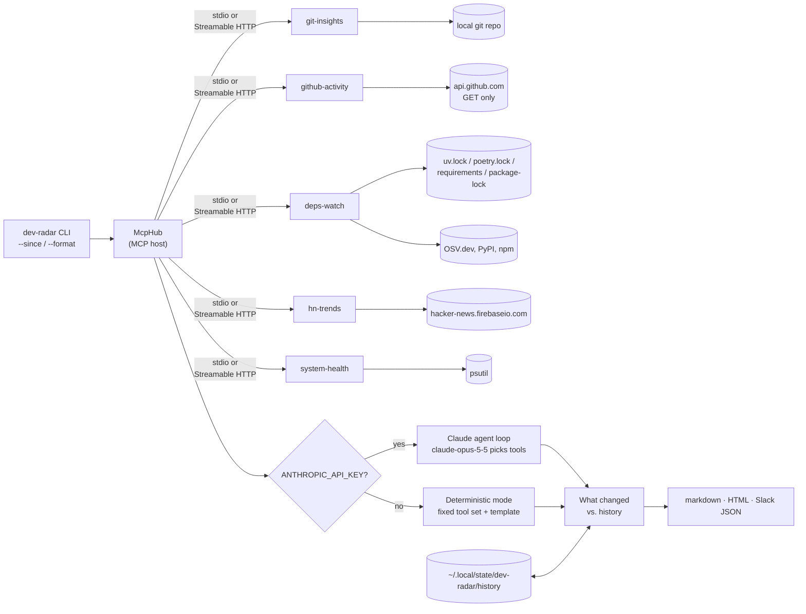

# Dev Radar

A small **MCP host** that connects to five custom **Model Context Protocol** servers, gathers data from all of them, and writes a daily engineering briefing as markdown, self-contained HTML, or a Slack webhook payload. Claude writes the briefing when an API key is available. Without one, a deterministic template does, so the demo always runs. Each run is saved, and the next one opens with **what changed since yesterday**.

| Server | Tools | Resources | Prompts |
|---|---|---|---|
| `git-insights` | `recent_commits`, `churn_hotspots`, `top_authors` | `git://summary` | `standup` |
| `github-activity` | `prs_awaiting_review`, `ci_status`, `recent_releases` (read-only) | `github://repos`, `github://ci` (subscribable) | `review_queue` |
| `deps-watch` | `list_dependencies`, `outdated`, `vulnerabilities` (OSV.dev) | `deps://vulnerabilities` (subscribable) | `triage_dependencies` |
| `hn-trends` | `top_stories` (keyword filter on the public HN Firebase API) | `hn://item/{item_id}` | |
| `system-health` | `snapshot`, `top_processes` | `system://snapshot` | |

Every tool validates its input with pydantic constraints: bounded windows and limits, `Literal` enums, `owner/name` patterns, non-empty keywords, and paths that must exist. Invalid calls come back as MCP tool errors, not crashes. Every server speaks **stdio** (default) or **Streamable HTTP** (`--transport streamable-http`).

## Architecture



- `src/dev_radar/servers/*.py`: the five servers, built on the official `mcp` Python SDK (v2 `MCPServer`). `servers/__init__.py` holds the shared `--transport` switch.
- `src/dev_radar/hub.py`: spawns each server as a subprocess (or connects to a Streamable HTTP URL), lists its tools under `<server>__<tool>` names, and converts them into Claude tool definitions.
- `src/dev_radar/briefing.py`: both modes. **Claude mode** runs a manual tool-use loop. It runs parallel tool calls concurrently, sends every result back in one turn, reports errors as `is_error` tool results, and stops on `refusal`, `max_tokens` or a 10-turn cap. **Fallback mode** makes eleven tool calls concurrently and fills in a template. If one server fails, its section shows an inline note and the rest of the briefing still renders.
- `src/dev_radar/history.py`: saves each run's structured tool data and diffs it against the latest run from before today: new commits, CI state flips, PRs entering or leaving review, releases, new/resolved vulnerabilities, outdated packages, hotspot moves, new HN matches, memory/disk swings.
- `src/dev_radar/render.py`: converts the markdown into one HTML file (inline CSS, light/dark, no scripts or external assets) or a Slack incoming-webhook payload (mrkdwn).

## Quick start

```bash
uv sync
uv run dev-radar --mode fallback              # no key needed
uv run dev-radar --repo ~/code/my-service --since 36h --keywords "ai,postgres,kubernetes" --out briefing.md
uv run dev-radar --github-repos me/api,me/web --since yesterday
export ANTHROPIC_API_KEY=...                  # then --mode auto (default) uses Claude
uv run dev-radar --list-tools                 # show what the host discovered
```

`--mode auto` uses Claude when `ANTHROPIC_API_KEY` is set. If the API call fails, it falls back to deterministic mode. `--mode claude` never falls back.

**Window.** `--days N` or `--since` with `36h`, `3d`, `2w`, `yesterday` or an ISO date/datetime. git tools get the exact cut-off; day-granular tools (churn, releases) get the smallest whole-day window that covers it.

**Formats.**

```bash
uv run dev-radar --format html --out briefing.html          # one self-contained file
uv run dev-radar --format slack > briefing.json             # {"text": "<mrkdwn>", ...}
curl -X POST -H 'content-type: application/json' -d @briefing.json "$SLACK_WEBHOOK_URL"
```

**History.** Each run is saved to `$XDG_STATE_HOME/dev-radar/history/<repo>-<hash>/` (default `~/.local/state/...`, override with `--history-dir`). The next run inserts a `## What changed since yesterday` section after the TL;DR. `--list-history` lists saved runs; `--no-history` skips both saving and the diff.

## GitHub and dependency servers

`github-activity` only issues `GET` requests. The token comes from `GITHUB_TOKEN`, then `gh auth token`, else it goes anonymous (public repos, 60 requests/hour). Repos come from each call's `repos` argument, `--github-repos`, or `DEV_RADAR_GITHUB_REPOS=owner/a,owner/b`. One repo failing (404, rate limit) becomes an `errors` row; the others still report.

`deps-watch` reads pinned versions from `uv.lock`, `poetry.lock`, `requirements*.txt` and `package-lock.json` (v2/v3), marking direct vs transitive. `outdated` checks direct dependencies against PyPI/npm; `vulnerabilities` sends every pin through OSV.dev `querybatch` and expands each hit with severity and fixed versions.

## Prompts and subscriptions

Servers ship prompt templates (`prompts/list`, `prompts/get`): `standup` embeds the recent commit log, `review_queue` and `triage_dependencies` walk a model through the right tools and output shape.

`github://ci` and `deps://vulnerabilities` are subscribable. The `ci_status` and `vulnerabilities` tools publish a resource-updated event when a repo's CI state or a project's vulnerability IDs change. This uses the SDK's `subscriptions/listen` stream (protocol 2026-07-28); the SDK's `MCPServer` does not serve legacy `resources/subscribe`, so 2025-era clients see `subscribe: false`.

```python
async with Client("http://127.0.0.1:8000/mcp") as c:
    async with c.listen(resource_subscriptions=["github://ci"]) as sub:
        await c.call_tool("ci_status", {"repos": ["me/api"]})
        async for event in sub:                     # ResourceUpdated(uri="github://ci")
            print(await c.read_resource(event.uri))
```

## Streamable HTTP

```bash
uv run dev-radar-github --transport streamable-http --port 8001     # serves http://127.0.0.1:8001/mcp
uv run dev-radar --connect github=http://127.0.0.1:8001/mcp         # the host uses it instead of spawning one
```

The default bind is `127.0.0.1`, which keeps the SDK's DNS-rebinding protection on. Servers started this way read their own environment (`DEV_RADAR_REPO`, `DEV_RADAR_GITHUB_REPOS`, ...), not the host's `--repo`.

## Use the servers from Claude Code / Claude Desktop

This repo ships a project-scoped [`.mcp.json`](.mcp.json). Open Claude Code in this directory and approve the five `dev-radar-*` servers. For Claude Desktop, copy [`examples/claude_desktop_config.json`](examples/claude_desktop_config.json) into `claude_desktop_config.json` and replace the absolute paths and repo names.

You can also run a server directly with `uv run dev-radar-git` (or `-hn`, `-system`, `-github`, `-deps`). It speaks MCP on stdin/stdout.

## Sample briefing

This is real output from `uv run dev-radar --mode fallback --github-repos <all 11 sakshamchitkara-dotcom repos>` on this repo, second run of the day. Full files: [`docs/sample-briefing.md`](docs/sample-briefing.md) and [`docs/sample-briefing.html`](docs/sample-briefing.html).

## Tests

```bash
uv run pytest -v
```

- **In-process:** each server is tested through `mcp.Client(server)`. git runs against a throwaway repo, GitHub and deps-watch against `httpx.MockTransport` (the GitHub mock asserts every request is a `GET`), HN against a fake feed, and system-health against the real psutil. Prompts and `subscriptions/listen` events are tested the same way.
- **Over stdio / HTTP:** `McpHub` spawns the real subprocesses. The tests cover tool discovery, validation errors, the fallback briefing with HN pointed at a dead port, GitHub unconfigured and an unparseable lockfile, a server over Streamable HTTP (directly and through the hub), the Claude loop with a scripted fake client, and the CLI twice in a row to check the history diff and HTML output.
- **Pure functions:** `--since` parsing, history diff/baseline selection, and the HTML/Slack renderers (escaping, no `javascript:` links).

CI runs the suite on Ubuntu and macOS with Python 3.11–3.13, then smoke-runs the briefing with github-activity pointed at this repository (read-only `GITHUB_TOKEN`) in markdown, HTML and Slack formats.

## Configuration

| Env var | Used by | Default |
|---|---|---|
| `ANTHROPIC_API_KEY` | Claude mode | unset → fallback |
| `DEV_RADAR_REPO` | git-insights / deps-watch default project | cwd |
| `DEV_RADAR_GITHUB_REPOS` | github-activity default repos | unset → section shows a setup hint |
| `GITHUB_TOKEN` | github-activity | `gh auth token`, else anonymous |
| `XDG_STATE_HOME` | history location | `~/.local/state` |
| `HN_API_BASE`, `GITHUB_API_BASE`, `OSV_API_BASE`, `PYPI_API_BASE`, `NPM_API_BASE` | API base URLs (tests, mirrors) | public endpoints |
