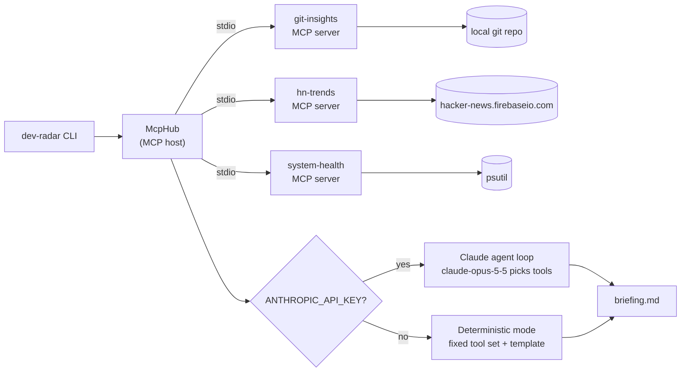

# Dev Radar

A small **MCP host** that launches three custom **Model Context Protocol** servers over stdio, gathers data from all of them, and writes a daily engineering briefing in markdown. Claude writes the briefing when an API key is available. Without one, a deterministic template does, so the demo always runs.

| Server | Tools | Resources |
|---|---|---|
| `git-insights` | `recent_commits`, `churn_hotspots`, `top_authors` | `git://summary` |
| `hn-trends` | `top_stories` (keyword filter on the public HN Firebase API) | `hn://item/{item_id}` |
| `system-health` | `snapshot`, `top_processes` | `system://snapshot` |

Every tool validates its input with pydantic constraints: bounded day windows and limits, `Literal` enums, non-empty keywords, and paths that must exist or sit inside a git repo. Invalid calls come back as MCP tool errors, not crashes.

## Architecture



- `src/dev_radar/servers/*.py`: the three servers, built on the official `mcp` Python SDK (v2 `MCPServer`).
- `src/dev_radar/hub.py`: spawns each server as a subprocess, lists its tools under `<server>__<tool>` names, and converts them into Claude tool definitions.
- `src/dev_radar/briefing.py`: holds both modes. **Claude mode** runs a manual tool-use loop. It runs parallel tool calls concurrently, sends every result back in one turn, reports errors as `is_error` tool results, and stops on `refusal`, `max_tokens` or a 10-turn cap. **Fallback mode** makes six tool calls concurrently and fills in a template. If one server fails, its section shows an inline note and the rest of the briefing still renders.

## Quick start

```bash
uv sync
uv run dev-radar --mode fallback              # no key needed
uv run dev-radar --repo ~/code/my-service --days 14 --keywords "ai,postgres,kubernetes" --out briefing.md
export ANTHROPIC_API_KEY=...                  # then --mode auto (default) uses Claude
uv run dev-radar --list-tools                 # show what the host discovered
```

`--mode auto` uses Claude when `ANTHROPIC_API_KEY` is set. If the API call fails, it falls back to deterministic mode. `--mode claude` never falls back.

## Use the servers from Claude Code / Claude Desktop

This repo ships a project-scoped [`.mcp.json`](.mcp.json). Open Claude Code in this directory and approve the three `dev-radar-*` servers:

```json
{
  "mcpServers": {
    "dev-radar-git":    { "command": "uv", "args": ["run", "--quiet", "dev-radar-git"], "env": { "DEV_RADAR_REPO": "." } },
    "dev-radar-hn":     { "command": "uv", "args": ["run", "--quiet", "dev-radar-hn"] },
    "dev-radar-system": { "command": "uv", "args": ["run", "--quiet", "dev-radar-system"] }
  }
}
```

For Claude Desktop, copy [`examples/claude_desktop_config.json`](examples/claude_desktop_config.json) into `claude_desktop_config.json` and replace the absolute paths.

You can also run a server directly with `uv run dev-radar-git`. It speaks MCP on stdin/stdout.

## Sample briefing

This is real output from `uv run dev-radar --mode fallback` on this repo. The full file is [`docs/sample-briefing.md`](docs/sample-briefing.md).

```markdown
# Dev Radar - 2026-09-25

_Repo `dev-radar` · last 7d · deterministic mode_

## TL;DR
- 19 commit(s) in the last 7 days by 1 author(s)
- Hottest file: `src/dev_radar/briefing.py` (3 commits)
- Machine healthy (no metric over threshold)

## Churn hotspots
| File | Commits | +lines | -lines |
|---|---:|---:|---:|
| `src/dev_radar/briefing.py` | 3 | 203 | 4 |
...

## Industry radar (ai, llm, llms, python, rust, postgres, security, mcp)
- [Security auditing in the age of (good enough) AI](https://blog.trailofbits.com/2026/09/18/auditing-in-the-age-of-good-enough-ai/) — 85 pts, [12 comments](https://news.ycombinator.com/item?id=49793957)
...
```

## Tests

```bash
uv run pytest -v
```

- **In-process:** each server is tested through `mcp.Client(server)`. git runs against a throwaway repo, HN against a fake feed, and system-health against the real psutil.
- **Over stdio:** `McpHub` spawns the real subprocesses. The tests cover tool discovery, validation errors, and the fallback briefing with HN pointed at a dead port, which checks the degraded path. The Claude loop runs with a scripted fake client, and the CLI runs as a subprocess.

CI runs the suite and a fallback briefing on Ubuntu and macOS with Python 3.11–3.13.

## Configuration

| Env var | Used by | Default |
|---|---|---|
| `ANTHROPIC_API_KEY` | Claude mode | unset → fallback |
| `DEV_RADAR_REPO` | git-insights default repo | cwd |
| `HN_API_BASE` | hn-trends | `https://hacker-news.firebaseio.com/v0` |
