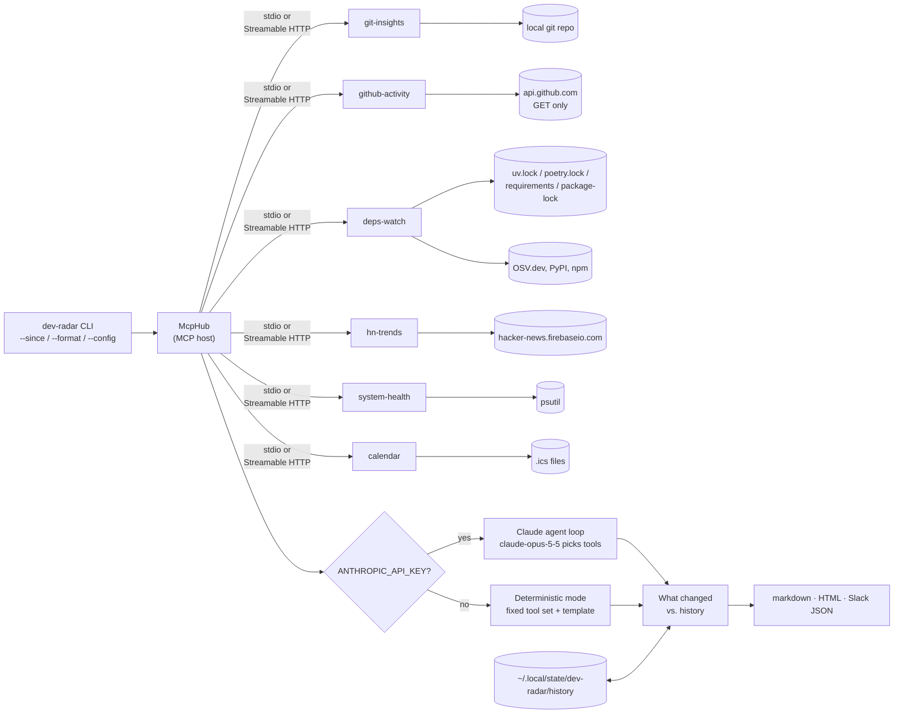

# Dev Radar

A small **MCP host** that connects to seven custom **Model Context Protocol** servers, gathers data from all of them, and writes a daily engineering briefing as markdown, self-contained HTML, or a Slack webhook payload. Claude writes the briefing when credentials are available (API key, auth token or an `ant auth login` profile). Without one, a deterministic template does, so the demo always runs. Each run is saved, and the next one opens with **what changed since yesterday**.

| Server | Tools | Resources | Prompts |
|---|---|---|---|
| `git-insights` | `recent_commits`, `churn_hotspots`, `top_authors` | `git://summary` | `standup` |
| `github-activity` | `prs_awaiting_review`, `ci_status`, `recent_releases` (read-only) | `github://repos`, `github://ci` (subscribable) | `review_queue` |
| `deps-watch` | `list_dependencies`, `outdated`, `vulnerabilities` (OSV.dev) | `deps://vulnerabilities` (subscribable) | `triage_dependencies` |
| `hn-trends` | `top_stories` (keyword filter on the public HN Firebase API) | `hn://item/{item_id}` | |
| `system-health` | `snapshot`, `top_processes` | `system://snapshot` | |
| `calendar` | `events` (today's meetings from local `.ics` files) | `calendar://today` | |

Every tool validates its input with pydantic constraints: bounded windows and limits, `Literal` enums, `owner/name` patterns, non-empty keywords, and paths that must exist. Invalid calls come back as MCP tool errors, not crashes. Every server speaks **stdio** (default) or **Streamable HTTP** (`--transport streamable-http`, optionally behind a bearer token).

## Architecture



- `src/dev_radar/servers/*.py`: the seven servers, built on the official `mcp` Python SDK (v2 `MCPServer`). `servers/__init__.py` holds the shared `--transport` switch and the bearer-token guard.
- `src/dev_radar/hub.py`: spawns each server as a subprocess (or connects to a Streamable HTTP URL), lists its tools under `<server>__<tool>` names, and converts them into Claude tool definitions. A server that cannot be reached is skipped (its sections say so) instead of failing the run, and every call's latency is recorded for `--timings`.
- `src/dev_radar/briefing.py`: both modes. **Claude mode** runs a manual tool-use loop. It runs parallel tool calls concurrently, sends every result back in one turn, reports errors as `is_error` tool results, and stops on `refusal`, `max_tokens` or a 10-turn cap. **Fallback mode** makes twelve tool calls concurrently and fills in a template. If one server fails, its section shows an inline note and the rest of the briefing still renders.
- `src/dev_radar/history.py`: saves each run's structured tool data and diffs it against the latest run from before today: new commits, CI state flips, PRs entering or leaving review, releases, new/resolved vulnerabilities, outdated packages, hotspot moves, new HN matches, memory/disk swings.
- `src/dev_radar/config.py`: the optional TOML config (flag defaults and `[sections]` on/off).
- `src/dev_radar/render.py`: converts the markdown into one HTML file (inline CSS, light/dark, no scripts or external assets) or a Slack incoming-webhook payload (mrkdwn).

## Quick start

```bash
uv sync
uv run dev-radar --mode fallback              # no key needed
uv run dev-radar --repo ~/code/my-service --since 36h --keywords "ai,postgres,kubernetes" --out briefing.md
uv run dev-radar --github-repos me/api,me/web --since yesterday
uv run dev-radar --calendars examples/team.ics --timings   # add today's meetings; print tool latency
export ANTHROPIC_API_KEY=...                  # then --mode auto (default) uses Claude
uv run dev-radar --list-tools                 # show what the host discovered
```

`--mode auto` uses Claude when the SDK finds credentials: `ANTHROPIC_API_KEY`, `ANTHROPIC_AUTH_TOKEN`, an `ant auth login` profile, or workload identity federation. If the API call fails, it falls back to deterministic mode. `--mode claude` never falls back.

**Window.** `--days N` or `--since` with `36h`, `3d`, `2w`, `yesterday` or an ISO date/datetime. git tools get the exact cut-off; day-granular tools (churn, releases) get the smallest whole-day window that covers it.

**Formats.**

```bash
uv run dev-radar --format html --out briefing.html          # one self-contained file
uv run dev-radar --format slack > briefing.json             # {"text": "<mrkdwn>", ...}
curl -X POST -H 'content-type: application/json' -d @briefing.json "$SLACK_WEBHOOK_URL"
```

**History.** Each run is saved to `$XDG_STATE_HOME/dev-radar/history/<repo>-<hash>/` (default `~/.local/state/...`, override with `--history-dir`). The next run inserts a `## What changed since yesterday` section after the TL;DR. `--list-history` lists saved runs; `--no-history` skips both saving and the diff. Only the newest 90 runs are kept (`--keep N`, `0` = all).

**Timings.** `--timings` prints per-tool latency to stderr after the run. Real output from the sample run below:

```text
tool                             calls errors   max ms  total ms
hn__top_stories                      1      0     1466      1466
github__ci_status                    1      0     1464      1464
github__prs_awaiting_review          1      0      951       951
github__recent_releases              1      0      949       949
deps__vulnerabilities                1      0      410       410
system__snapshot                     1      0      308       308
deps__outdated                       1      0      224       224
git__churn_hotspots                  1      0      119       119
git__top_authors                     1      0       56        56
git__recent_commits                  1      0       47        47
system__top_processes                1      0       45        45
calendar__events                     1      0       43        43
```

## Config file

`--config path.toml`, or `$XDG_CONFIG_HOME/dev-radar/config.toml` (default `~/.config/...`) when it exists. Keys set flag defaults; flags still win. `[sections]` switches briefing sections off, and a disabled section's tools are never called.

```toml
keywords = ["rust", "postgres"]
github_repos = ["me/api", "me/web"]
calendars = ["~/calendars/work.ics"]
days = 3

[sections]              # todays_meetings, repo_activity, churn_hotspots, github,
industry_radar = false  # dependencies, industry_radar, machine_health, suggested_focus_today
machine_health = false
```

Unknown keys and sections are errors:

```text
$ dev-radar --config bad.toml
dev-radar: error: --config: bad.toml: unknown key 'weather'; use ['calendars', 'days', 'format', 'github_repos', 'keep', 'keywords', 'mode', 'repo', 'sections']
```

## Calendar server

`research` has two tools: `arxiv_papers` (newest submissions in `DEV_RADAR_ARXIV_CATEGORIES`, default `cs.SE,cs.AI`, filtered by keyword over title and abstract) and `feed_items` (recent posts from the RSS/Atom URLs in `DEV_RADAR_FEEDS`). `feed_items` only fetches the configured feeds and never takes a URL from the caller. Claude mode can call both; the deterministic template does not use them yet.

`calendar` reads `.ics` files or directories listed in `DEV_RADAR_CALENDARS` (or `--calendars`), separated by `:` (`;` on Windows). Export a calendar from Google, Outlook or Apple Calendar, or point it at a synced file; no OAuth. It handles line folding and escapes, TZID/UTC/floating and all-day times, `DURATION`, cancelled events, `EXDATE`, moved or cancelled single instances (`RECURRENCE-ID`), and `DAILY`/`WEEKLY`/`MONTHLY`/`YEARLY` recurrence with `INTERVAL`, `COUNT`, `UNTIL`, `BYDAY` (including `2TU`, `-1FR`), `BYMONTHDAY`, `BYMONTH` and `BYSETPOS`. Real resource output for [`examples/team.ics`](examples/team.ics) on a Friday:

```json
{"day":"2026-09-25","days":1,"events":[{"title":"Team standup","start":"2026-09-25T09:30:00-07:00","end":"2026-09-25T09:45:00-07:00","all_day":false,"location":"Zoom","calendar":"team.ics"}],"calendars":["team.ics"],"errors":[]}
```

A monthly "last Friday" retro plus a Thursday sync moved to Friday via `RECURRENCE-ID`, real output from `dev-radar --mode fallback --calendars demo.ics:examples/team.ics` on 2026-09-25:

```markdown
## Today's meetings
- 09:30–09:45 Team standup (Zoom)
- 15:00–16:00 Monthly retro
- 16:00–16:30 Design sync (moved)
```

## GitHub and dependency servers

`github-activity` only issues `GET` requests. The token comes from `GITHUB_TOKEN`, then `gh auth token`, else it goes anonymous (public repos, 60 requests/hour). Repos come from each call's `repos` argument, `--github-repos`, or `DEV_RADAR_GITHUB_REPOS=owner/a,owner/b`. One repo failing (404, rate limit) becomes an `errors` row; the others still report.

`deps-watch` reads pinned versions from `uv.lock`, `poetry.lock`, `requirements*.txt` and `package-lock.json` (v2/v3), marking direct vs transitive. `outdated` checks direct dependencies against PyPI/npm; `vulnerabilities` sends every pin through OSV.dev `querybatch` and expands each hit with severity and fixed versions.

## Prompts and subscriptions

Servers ship prompt templates (`prompts/list`, `prompts/get`): `standup` embeds the recent commit log, `review_queue` and `triage_dependencies` walk a model through the right tools and output shape.

`github://ci` and `deps://vulnerabilities` are subscribable. The `ci_status` and `vulnerabilities` tools publish a resource-updated event when a repo's CI state or a project's vulnerability IDs change. This uses the SDK's `subscriptions/listen` stream (protocol 2026-07-28); the SDK's `MCPServer` does not serve legacy `resources/subscribe`, so 2025-era clients see `subscribe: false`.

```python
async with Client("http://127.0.0.1:8000/mcp") as c:
    async with c.listen(resource_subscriptions=["github://ci"]) as sub:
        await c.call_tool("ci_status", {"repos": ["me/api"]})
        async for event in sub:                     # ResourceUpdated(uri="github://ci")
            print(await c.read_resource(event.uri))
```

## Streamable HTTP

```bash
uv run dev-radar-github --transport streamable-http --port 8001     # serves http://127.0.0.1:8001/mcp
uv run dev-radar --connect github=http://127.0.0.1:8001/mcp         # the host uses it instead of spawning one
```

The default bind is `127.0.0.1`, which keeps the SDK's DNS-rebinding protection on.

**Bearer token.** Set `DEV_RADAR_HTTP_TOKEN` on the server and every request without `Authorization: Bearer <token>` gets a 401. The host sends the same variable for `--connect` URLs. A non-loopback `--host` is refused without a token. Real output:

```text
$ DEV_RADAR_HTTP_TOKEN=... uv run dev-radar-git --transport streamable-http --port 8765 &
$ curl -si -X POST http://127.0.0.1:8765/mcp -d '{}' | head -1
HTTP/1.1 401 Unauthorized
$ DEV_RADAR_HTTP_TOKEN=wrong uv run dev-radar --connect git=http://127.0.0.1:8765/mcp ...
warning: git server unavailable, its sections will say so (MCPError: Server returned an error response)
$ uv run dev-radar-git --transport streamable-http --host 0.0.0.0
git-insights: error: --host 0.0.0.0 exposes the server beyond this machine; set DEV_RADAR_HTTP_TOKEN to require a bearer token
``` Servers started this way read their own environment (`DEV_RADAR_REPO`, `DEV_RADAR_GITHUB_REPOS`, ...), not the host's `--repo`.

## Use the servers from Claude Code / Claude Desktop

This repo ships a project-scoped [`.mcp.json`](.mcp.json). Open Claude Code in this directory and approve the seven `dev-radar-*` servers. For Claude Desktop, copy [`examples/claude_desktop_config.json`](examples/claude_desktop_config.json) into `claude_desktop_config.json` and replace the absolute paths and repo names.

You can also run a server directly with `uv run dev-radar-git` (or `-hn`, `-system`, `-github`, `-deps`, `-calendar`). It speaks MCP on stdin/stdout.

## Sample briefing

This is real output from `uv run dev-radar --mode fallback --github-repos <all 17 sakshamchitkara-dotcom repos> --calendars examples/team.ics --timings` on this repo. It is the second run of the day; the baseline ran two minutes earlier, so the diff heading shows that time instead of "yesterday". Full files: [`docs/sample-briefing.md`](docs/sample-briefing.md) and [`docs/sample-briefing.html`](docs/sample-briefing.html) (the same markdown through `--format html`).

```markdown
# Dev Radar - 2026-09-25

_Repo `dev-radar` · last 7d · deterministic mode_

## TL;DR
- 56 commit(s) in the last 7 days by 1 author(s)
- Hottest file: `src/dev_radar/cli.py` (12 commits)
- CI failing on sakshamchitkara-dotcom/teaspoon-landing, sakshamchitkara-dotcom/issue-autopilot-sandbox
- 1 meeting(s) today, first at 09:30 (Team standup)
- Machine healthy (no metric over threshold)

## What changed since 2026-09-25 03:06
- CI `sakshamchitkara-dotcom/issue-autopilot`: pending → **success**
- CI `sakshamchitkara-dotcom/scrapekit`: success → **pending**
- CI `sakshamchitkara-dotcom/dev-radar`: pending → **success**

## Today's meetings
- 09:30–09:45 Team standup (Zoom)

## GitHub
- CI `sakshamchitkara-dotcom/issue-autopilot` main@6cdfc2f: **success**
- CI `sakshamchitkara-dotcom/review-bot` main@2e86eb1: **success**
- CI `sakshamchitkara-dotcom/scrapekit` main@583a551: **pending**
- CI `sakshamchitkara-dotcom/rag-engine` main@8822c2c: **success**
...

## Dependencies
- 0 known vulnerabilit(ies) across 45 pinned package(s) (OSV.dev)
- 0 of 5 direct dependencies behind latest

## Suggested focus today
- Fix the red default branch on sakshamchitkara-dotcom/teaspoon-landing, sakshamchitkara-dotcom/issue-autopilot-sandbox before merging anything else.
- Review sakshamchitkara-dotcom/agent-fleet-sandbox#4 — oldest PR waiting (0d).
- Review test coverage for `src/dev_radar/cli.py` — it changes more than anything else.
- Skim "Using LLMs to trace alchemical knowledge and decode 17th century letters" — top match for your keywords.
```

## Tests

```bash
uv run pytest -v
```

- **In-process:** each server is tested through `mcp.Client(server)`. git runs against a throwaway repo, GitHub and deps-watch against `httpx.MockTransport` (the GitHub mock asserts every request is a `GET`), HN against a fake feed, and system-health against the real psutil. Prompts and `subscriptions/listen` events are tested the same way.
- **Over stdio / HTTP:** `McpHub` spawns the real subprocesses. The tests cover tool discovery, validation errors, the fallback briefing with HN pointed at a dead port, GitHub unconfigured and an unparseable lockfile, a server over Streamable HTTP (directly and through the hub), the Claude loop with a scripted fake client, and the CLI twice in a row to check the history diff and HTML output.
- **Pure functions:** `--since` parsing, CLI argument errors, credential detection, config loading and section removal, the fallback template with full, empty and all-failed data, the Claude loop's refusal/max_tokens/turn-cap exits, history diff/baseline/pruning, PEP 440 version ordering, `.ics` parsing and recurrence (daily through yearly, `BYSETPOS`, moved/cancelled instances), and the HTML/Slack renderers (escaping, no `javascript:` links).
- **Robustness:** the hub with one server down and one crashing on start, latency records, GitHub pagination over two pages, and a bearer-token-guarded HTTP server (401 without the token, working with it through the hub, public bind refused).

CI runs the suite on Ubuntu and macOS with Python 3.11–3.13, then smoke-runs the briefing with github-activity pointed at this repository (read-only `GITHUB_TOKEN`) in markdown, HTML and Slack formats. Two more smoke steps run a config file with sections disabled plus the example calendar (checking the disabled tools are never called, via `--timings`), and a bearer-token HTTP server that must 401 on `curl` and still serve `dev-radar --connect`.

## Configuration

| Env var | Used by | Default |
|---|---|---|
| `ANTHROPIC_API_KEY` / `ANTHROPIC_AUTH_TOKEN` / `ANTHROPIC_PROFILE` | Claude mode | none found → fallback |
| `DEV_RADAR_REPO` | git-insights / deps-watch default project | cwd |
| `DEV_RADAR_GITHUB_REPOS` | github-activity default repos | unset → section shows a setup hint |
| `GITHUB_TOKEN` | github-activity | `gh auth token`, else anonymous |
| `DEV_RADAR_CALENDARS` | calendar server (`.ics` files/dirs, `os.pathsep`-separated) | unset → section shows a setup hint |
| `DEV_RADAR_HTTP_TOKEN` | Streamable HTTP servers (required token) and the host (`--connect`) | unset → no auth, loopback only |
| `XDG_STATE_HOME` | history location | `~/.local/state` |
| `XDG_CONFIG_HOME` | config file location | `~/.config` |
| `HN_API_BASE`, `GITHUB_API_BASE`, `OSV_API_BASE`, `PYPI_API_BASE`, `NPM_API_BASE` | API base URLs (tests, mirrors) | public endpoints |

## Known limits

- **Calendar recurrence:** `BYHOUR`/`BYMINUTE`/`BYSECOND`, `WKST` other than Monday, and `BYSETPOS` with `BYWEEKNO`/`BYYEARDAY` are ignored; `RECURRENCE-ID;RANGE=THISANDFUTURE` only moves the one instance; Windows `TZID` names outside the built-in table fall back to local time, and on Windows the local zone is today's fixed UTC offset.
- **GitHub:** `prs_awaiting_review` reads at most 5 pages (500 open PRs) per repo and makes one reviews request per PR, so very busy repos cost many API calls.
- **HTTP auth** is one shared static token (`DEV_RADAR_HTTP_TOKEN`), not OAuth; the SDK's OAuth resource-server mode needs an authorization server this project does not run. Use TLS (a reverse proxy) for anything beyond loopback.
- **Subscriptions** use the SDK's `subscriptions/listen` stream (protocol 2026-07-28); 2025-era clients that only speak `resources/subscribe` see `subscribe: false`.
- **Claude mode** is covered by a scripted fake client in tests and CI; no test calls the live API.
